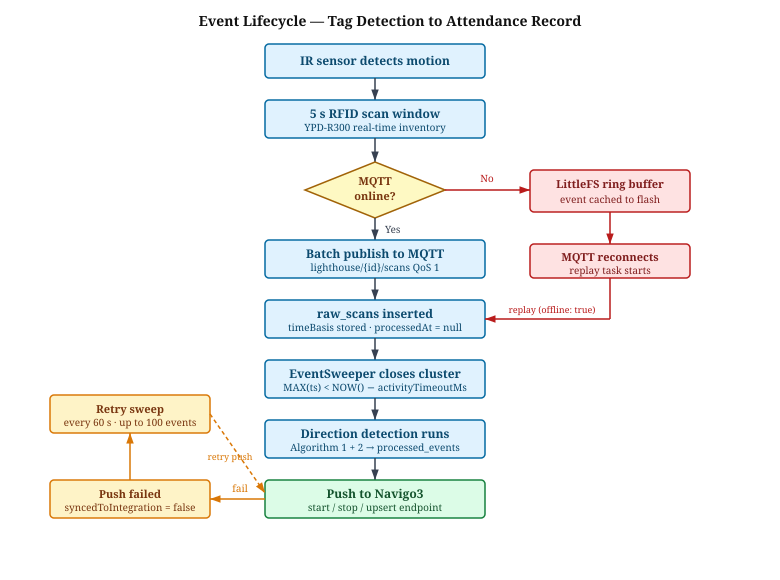

# OSNOVA PLUS - 3.1 system architecture

---

- The system is built around a portal model: two Lighthouse units are deployed on opposite sides of a doorway (one designated OUTSIDE, one INSIDE), collectively forming a single detection portal; a person crossing the threshold is detected by both units in a temporal sequence that encodes direction
- Each Lighthouse unit is an autonomous embedded device: ESP32-WROOM-32 microcontroller communicating with a YPD-R300 UHF RFID reader module over UART, with onboard power management, local offline event cache, and WiFi/MQTT connectivity
- All direction inference logic resides on the server, not the firmware; each Lighthouse unit publishes only raw timestamped RSSI readings - it has no knowledge of the other unit in its group and makes no direction decisions; this keeps the firmware thin and the detection logic centrally maintainable
- Lighthouse units are logically paired on the server into a **group**; the group is the unit of direction detection - scans are clustered and processed per (tag EPC, group) pair; a Lighthouse can belong to at most one group
- The server exposes a REST API and embedded MQTT broker; it hosts the direction detection pipeline, user/tag management, Navigo3 integration, and serves the web dashboard as a static build from the same process
- Navigo3 is the implemented enterprise integration target; the integration layer is isolated behind an environment-variable-controlled connector, making the architecture open to other systems without changes to the core event pipeline

**Table 3.1-1** - System components and their responsibilities

| Component            | Technology                         | Responsibility                                                      |
| -------------------- | ---------------------------------- | ------------------------------------------------------------------- |
| Lighthouse unit (×2) | ESP32-WROOM-32 + YPD-R300          | Passive UHF RFID detection; raw scan publish via MQTT               |
| Server               | BunJS, Hono, Aedes, PostgreSQL     | Scan ingestion, direction detection, user management, API           |
| Dashboard            | SolidJS SPA                        | Operator interface: device management, event monitoring, user setup |
| Navigo3 integration  | REST connector + background poller | Translates processed events into attendance records in Navigo3      |

- End-to-end event lifecycle from tag detection to attendance record:
  - IR sensor detects motion → firmware opens a 5-second RFID scan window
  - YPD-R300 runs continuous real-time inventory; detections batched and published to `lighthouse/{id}/scans` over MQTT (QoS 1) as timestamped RSSI arrays
  - Server scan handler ingests each batch; raw scans stored in `raw_scans` table with `timeBasis` field (`synced` / `estimated` / `relative`) preserved verbatim
  - EventSweeper background poller clusters unprocessed scans by (EPC, group); once a cluster is closed (no new scans for `activityTimeoutMs`), both direction detection algorithms run and produce a processed event row each
  - Processed event is immediately pushed to Navigo3 (`start` or `stop` endpoint); on failure, a background retry sweep picks it up within `NAVIGO3_RETRY_INTERVAL_MS`
  - If connectivity is lost before MQTT publish, the firmware caches events to a LittleFS ring buffer on flash and replays them on reconnection

**[Figure 3.1-3: Event lifecycle flowchart - linear left-to-right flow: IR trigger → RFID scan window →
MQTT batch publish → raw_scans insert → EventSweeper cluster detection → algorithm processing →
processed_events row → Navigo3 push; offline branch shown below main path: MQTT failure →
LittleFS cache → reconnect → replay → rejoin main path at raw_scans insert]**

---
