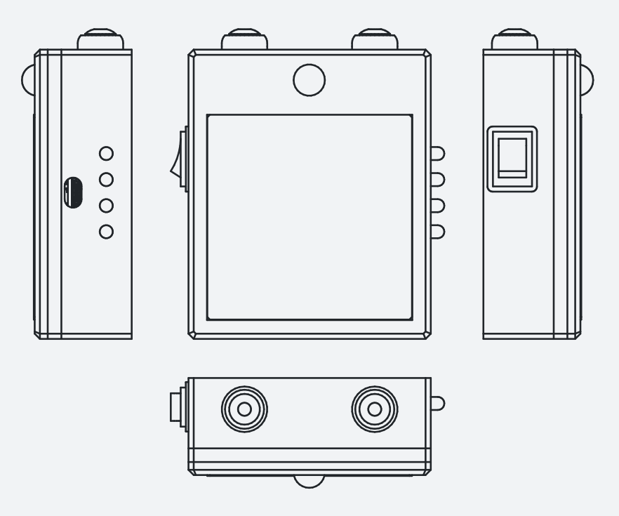
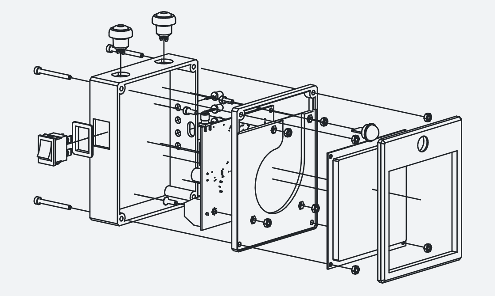

# OSNOVA PLUS - 3.2 hardware design

---

## 3.2.1 board v1 - breadboard prototype

- The first prototype was assembled on a breadboard using off-the-shelf breakout modules: ESP32-WROOM-32 development
  board , YPD-R300 UHF RFID reader module on carrier board, SX1308 DC-DC boost converter module, and
  TP4056/DW01HA lithium battery charger/protection module
- Each module was reverse-engineered prior to integration and schematics were traced from the physical PCBs to identify
  component values, internal routing, and undocumented connections; this was necessary because none of the modules
  shipped with engineering documentation beyond basic pinout labels
- The reverse-engineered schematics became the baseline for the Board v2 custom PCB design - the goal was to reproduce
  and then improve upon the combined functionality of these four modules on a single board

- Component selection was validated on the breadboard: ESP32-WROOM-32 confirmed as capable of running WiFi, MQTT, and
  UART-driven RFID operations concurrently using the dual-core architecture (WiFi stack pinned to Core 0, application
  logic on Core 1; per ESP32 TRM Section 1.1)
- YPD-R300 communicates with ESP32 via UART at 115 200 baud (per R300 Protocol Section 1.2); GPIO assignments for UART
  TX/RX, status LEDs, buttons, PIR input, and RFID power switch were established and carried forward to Board v2
- Power delivery on the breadboard used point-to-point wiring between modules; this introduced uncontrolled impedance
  and voltage drops under load, motivating the move to a purpose-designed PCB

**Table 3.2.1-1** - Reverse-engineered modules and their Board v2 disposition

| Module                   | Key components identified                                    | Disposition in Board v2                                                                 |
| ------------------------ | ------------------------------------------------------------ | --------------------------------------------------------------------------------------- |
| ESP32 dev board (38-pin) | AMS1117-3.3 LDO, CP2102 USB-UART, EN/BOOT buttons            | ESP32-WROOM-32 module placed directly; AMS1117 retained; CP2102 removed in favor or BoB |
| YPD-R300 carrier board   | R300 module, SMA connector, decoupling capacitors            | R300 module placed directly; SMA replaced with IPEX/U.FL footprint                      |
| SX1308 boost module      | SX1308 IC, 4.7 µH inductor, Schottky diode, feedback divider | Circuit reproduced with confirmed component values                                      |
| TP4056 charger module    | TP4056 IC, DW01HA protection, FS8205A dual MOSFET            | Circuit reproduced; charge current set via programming resistor                         |

### 3.2.2 board v2 - custom PCB

- Board v2 is a single two-layer PCB integrating all functionality of the four breadboard modules plus additional
  circuitry for power switching, fuse protection, battery monitoring, and consolidated USB-C connectivity
- Designed in KiCad; schematic split into four hierarchical sheets (see Appendix <>): top-level Lighthouse sheet,
  Charger submodule, Step-up DC/DC converter, and UHF RFID reader
- The CP2102 USB-UART bridge present on the original ESP32 dev board was omitted from Board v2 to reduce component cost
  and simplify SMD assembly; UART TX, RX, and GND are instead broken out to a pin header, allowing debug and flashing
  via an external USB-UART adapter
- The reader is assumed to have the schematic sheets from Appendix <> available for side-by-side reference; the
  following subsections describe key design decisions and deviations from the baseline breadboard design rather than
  replicating the full schematic content

#### USB-C connector

- The breadboard prototype used two separate USB connectors - one for power, one for CP2102 UART debug/flashing
- Board v2 consolidates power input into a single USB-C connector carrying only VBUS; the UART debug interface is
  separated to a dedicated pin header for use with an external USB-UART adapter
- USB-C UFP identification requires 5.1 kΩ pull-down resistors on CC1 and CC2 pins (per USB Type-C Specification Section
  4.5.1); without these, only certain USB sources will supply VBUS - an issue observed during breadboard testing where
  some chargers refused to provide power

#### Power delivery architecture

- Dual-input power with automatic source selection: USB 5 V (primary) and Li-ion battery via SX1308 boost converter
  (backup)
- SS24A Schottky diodes (DO-214AC, 2 A / 40 V, ~0.3–0.4 V forward drop) in OR configuration prevent backfeed between
  sources (see Step-up DC/DC converter sheet, Appendix <>)
- SF-1206SP100-2 slow-blow fuses (1 A, 63 VDC, 1206) on each input path, placed before the diodes; slow-blow type
  selected to tolerate RFID reader power-on inrush current
- DPDT slide switch after fuses and before diode junction provides complete power isolation of both input paths
  simultaneously while keeping fuses always in-circuit

#### RFID reader power switching

- BC337-25 NPN transistor (TO-92, CBE pinout flat face) used as low-side switch for the YPD-R300 power supply,
  controlled by ESP32 GPIO (see RFID reader sheet, Appendix <>)
- BC337-25 selected for low V_CE(sat) (~300 mV at 380 mA load), keeping the GND offset small enough to not affect R300
  operation; I_C(max) of 800 mA provides comfortable headroom over the reader's ~380 mA draw
- Base resistor: 150 Ω providing ~17 mA base drive for forced beta ~22 at 380 mA collector current, ensuring hard
  saturation

#### Supply stabilisation and decoupling

- The RFID reader draws current in sustained 18.8 ms pulses at 30–50 ms intervals during inventory; this profile
  requires bulk capacitance rather than ceramic-only decoupling

**Table 3.2.2-1** - Decoupling capacitance

| Location              | Capacitance          | Purpose                                  |
| --------------------- | -------------------- | ---------------------------------------- |
| RFID reader VCC input | 1000 µF electrolytic | Bulk reservoir for reader current pulses |
| ESP32 5 V VIN         | 1000 µF electrolytic | Bulk supply stabilisation                |
| ESP32 3.3 V rail      | 100 µF electrolytic  | LDO output stabilisation                 |

- ESP32 brownout detector disabled (`CONFIG_ESP_BROWNOUT_DET=n`); protection against supply collapse is instead provided
  by overlapping hardware mechanisms: TP4056 undervoltage cutoff, input fusing, and software battery voltage monitoring
  via ADC1/GPIO33

#### Battery voltage monitoring

- GPIO33 (ADC1_CH5) selected for cell voltage monitoring; ADC1 is safe for concurrent WiFi operation - ADC2 shares
  hardware with the WiFi RF subsystem and cannot be used reliably while WiFi is active (per ESP32 TRM Section 31.3)
- Voltage divider: R1 = 100 kΩ, R2 = 120 kΩ scales the 3.2–4.2 V cell range to 1.75–2.29 V, within ADC1 effective
  measurement range at 11 dB attenuation (per ESP32 Datasheet Table 4-4)

### 3.2.3 antenna and RF considerations

- UHF RFID operates in the 860–960 MHz range (ETSI band 865–868 MHz in Europe); at these frequencies, signal integrity
  of the connection between the R300 module's RF output and the antenna is critical
- A parallel wire pair is not viable at 900 MHz - the wavelength (~33 cm) means that even short unshielded runs act as
  radiating elements with uncontrolled impedance; 50 Ω coaxial cable is required for the antenna feed
- The YPD-R300 module's RF output is specified for 50 Ω impedance; any mismatch in the feed path causes reflected power,
  reducing effective radiated power and read range

#### Range disparity between units

- The different Board v2 units exhibited significantly different read ranges: one unit achieved ~3 m, the other ~0.5 m
- Probable cause identified as antenna cable joint quality:
  - The better-performing unit had its coaxial pigtail soldered directly onto the R300 module's RF output pad,
  bypassing all PCB tracesthe
  - The worse unit used the designated PCB edge mounted coaxial socket at ~2cm lead traces which while more principled
  yielded consistently worse results.
- Both R300 modules are firmware-identical and produce the same `set_power` response, confirming the RF feed path - not
  the module - as the variable

#### PCB trace impedance

- Board v2 routes a short PCB trace between the R300 module RF pad and the antenna connector footprint
- This trace should be impedance-controlled to 50 Ω; on a two-layer board with standard FR-4 substrate, achieving 50 Ω
  requires specific trace width relative to substrate thickness and copper weight - a constraint not explicitly verified
  during Board v2 layout
- The unit where the coaxial pigtail is soldered directly to the R300 (bypassing the PCB trace) consistently outperforms
  the unit using the PCB trace path, suggesting the trace introduces a meaningful impedance mismatch
- Future board revision should use a proper IPEX/U.FL receptacle with impedance-matched trace, or route the RF signal on
  an inner layer with a continuous ground plane reference

**[Figure 3.2.3-1: Annotated photograph or diagram comparing the two antenna connection methods - (a) coaxial pigtail
soldered directly to R300 RF pad, (b) signal routed through PCB trace to board-edge connector; impedance discontinuity
at the trace highlighted]**

### 3.2.4 enclosure

- A prototype enclosure was designed in FreeCAD to house the Board v2 PCB, battery, PIR sensor, and antenna in a
  wall-mountable form factor
- Design constraints: PIR sensor window must face the detection zone; antenna must be oriented toward the doorway with
  minimal obstruction; USB-C port accessible for power and debug; status LEDs visible; physical buttons accessible for
  provisioning trigger

- Full technical drawings of the enclosure are provided in Appendix <>
