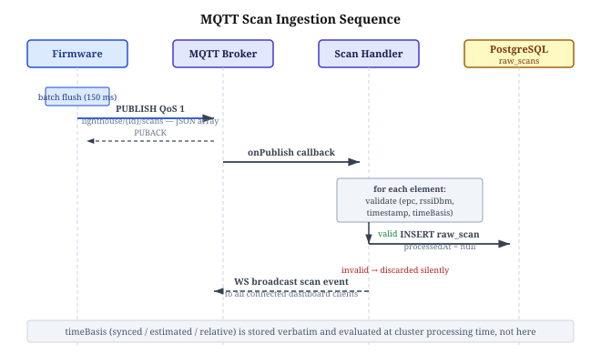
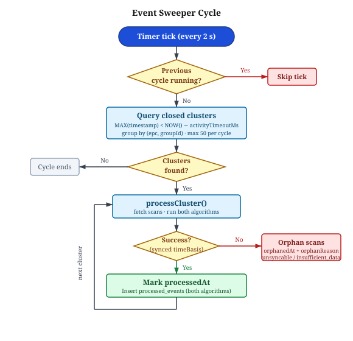
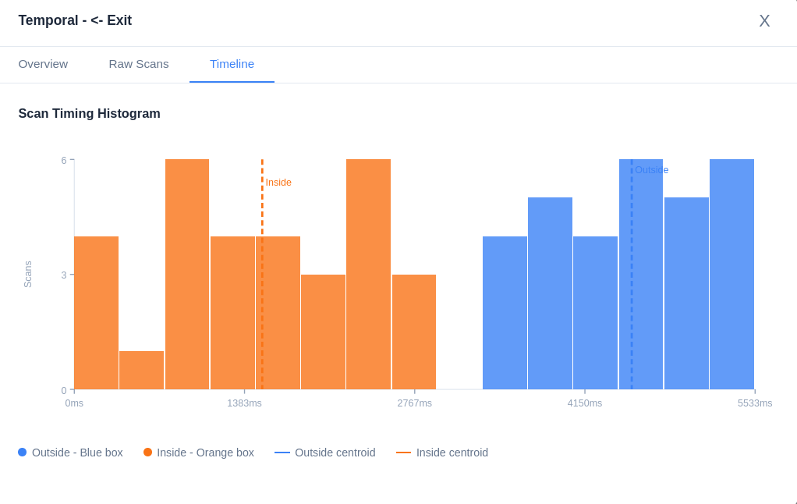
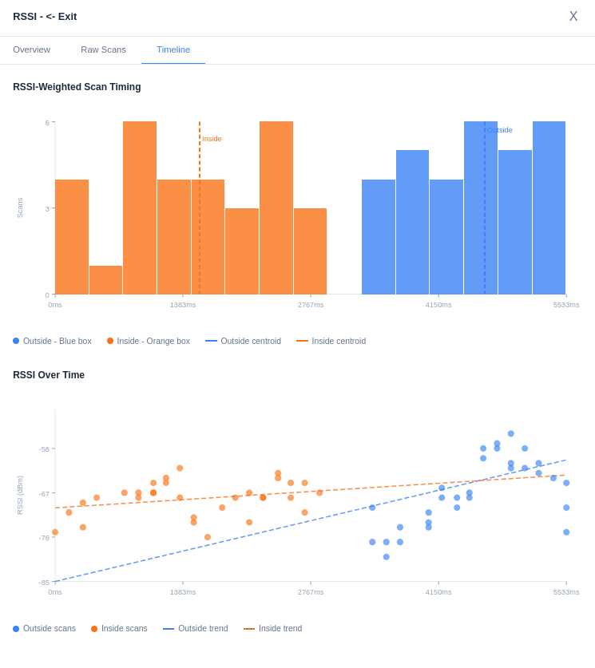
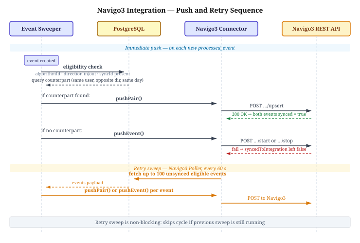

# OSNOVA PLUS - 3.4 server

---

## 3.4.1 infrastructure and stack

- Server runs as a single BunJS process hosting all subsystems: HTTP API, embedded MQTT broker, WebSocket gateway, background pollers
- Hono chosen as HTTP framework - lightweight, TypeScript-native, no runtime overhead
- PostgreSQL as the primary data store; Drizzle ORM for type-safe query building with migration support
- Aedes embedded as the MQTT broker - avoids external broker dependency, allows direct in-process message handling
- SolidJS frontend served as static build from the same process

**Table 3.4.1-1** - Server component responsibilities

| Component         | Technology               | Role                                       |
| ----------------- | ------------------------ | ------------------------------------------ |
| HTTP API          | Hono                     | REST endpoints, JWT auth                   |
| MQTT Broker       | Aedes                    | Receives firmware scan/health messages     |
| Database          | PostgreSQL + Drizzle ORM | Persistent event and user storage          |
| WebSocket Gateway | Bun WebSocket            | Real-time push to dashboard clients        |
| Navigo3 Poller    | Custom interval          | Periodic retry of unsynced events          |
| Event Sweeper     | Custom interval          | Cluster detection and direction processing |

**[Figure 3.4.1-1: Server internal component diagram - showing message flow from MQTT broker through scan handler to DB, and from event sweeper through algorithm layer to processed_events and WebSocket broadcast]**

---

## 3.4.2 event ingestion and raw scan storage

- Firmware publishes batched JSON arrays to MQTT topic `lighthouse/{id}/scans`
- Each array element contains: `epc`, `rssiDbm`, `timestampMs`, `timeBasis` (`synced` / `estimated` / `relative`)
- Server-side scan handler validates per-element; invalid elements discarded, valid ones persisted independently
- Raw scans stored in `raw_scans` table with `processedAt` and `orphanedAt` as null - marking pending status
- `timeBasis` stored verbatim; downstream processing rejects non-synced scans at cluster level (not here)
- Health telemetry published separately to `lighthouse/{id}/health`; stored but not part of event pipeline

**Table 3.4.2-1** - `raw_scans` table key fields

| Field        | Type                   | Description                                                |
| ------------ | ---------------------- | ---------------------------------------------------------- |
| id           | bigint                 | Auto-increment primary key                                 |
| lighthouseId | int                    | FK to lighthouses                                          |
| epc          | varchar                | Tag EPC identifier                                         |
| rssiDbm      | int (nullable)         | Signal strength in dBm                                     |
| timestamp    | timestamptz            | Tag detection time (from firmware)                         |
| timeBasis    | enum                   | `synced` / `estimated` / `relative`                        |
| processedAt  | timestamptz (nullable) | Set when cluster is processed                              |
| orphanedAt   | timestamptz (nullable) | Set when scan cannot be processed                          |
| orphanReason | enum (nullable)        | `insufficient_data` / `unsyncable` / `misconfigured_group` |

---

## 3.4.3 direction detection and event processing

### Cluster detection and event sweeper

- Background poller (`EventSweeper`) runs every **2 000 ms**; skips tick if previous cycle still running
- A cluster is defined as all `raw_scans` for a given `(epc, groupId)` pair where the latest scan timestamp is older than the group's `activityTimeoutMs` (default **4 000 ms**) - i.e. the tag has left the detection zone
- Cluster detection query groups unprocessed scans by `(epc, groupId)` and filters with `MAX(timestamp) < NOW() - activityTimeoutMs`
- Max **50 clusters** processed per cycle to bound cycle duration
- Scans for ungrouped lighthouses orphaned after **10 000 ms**

**[Figure 3.4.3-1: Event sweeper cycle flowchart - tick → query closed clusters → for each cluster: fetch scans → processCluster() → on success: mark processedAt; on failure: orphan or skip based on reason and age]**

### Algorithm 1 - temporal centroid

- Direction determined by comparing arithmetic mean timestamps of outside vs. inside scan groups
- `outsideCentroid < insideCentroid` → **in**; `insideCentroid < outsideCentroid` → **out**; |Δ| ≤ 1 ms → **unknown**
- Three multiplicative confidence factors, each clamped to [FLOOR, 1.0]:

**(Eq. 3.4.3-1)** Centroid separation factor:

$$CSF = \frac{|\bar{t}_{out} - \bar{t}_{in}|}{t_{cluster\_end} - t_{cluster\_start}}$$

**(Eq. 3.4.3-2)** Cluster size factor (saturates at n = 10):

$$CSzF = \min\!\left(1.0,\; \frac{n_{total} - 2}{8}\right)$$

**(Eq. 3.4.3-3)** Bilateral coverage factor:

$$BCF = \frac{\min(n_{in},\, n_{out})}{\max(n_{in},\, n_{out})}$$

**(Eq. 3.4.3-4)** Algorithm 1 confidence:

$$C_1 = CSF \times CSzF \times BCF$$

### Algorithm 2 - RSSI-weighted centroid

- RSSI values used as weights when computing the centroid of each lighthouse's scan group - stronger signal pulls the centroid toward the scan with highest received power
- Additionally: linear regression of RSSI vs. time computed independently for inside and outside groups; slope sign compared against expected direction to produce a **RSSI trend consistency factor** (RTCF)
- Expected slopes for **in** direction: outside slope < 0 (signal weakens as person departs), inside slope > 0 (signal strengthens as person approaches)
- RTCF = 1.0 when both trends agree; RTCF = FLOOR when both contradict; RTCF = 0.5 when fewer than 3 scans on either side (regression unreliable) or one side inconclusive
- Algorithm 2 can resolve direction even when temporal centroids are equal - RSSI weighting shifts the effective centroids apart

**(Eq. 3.4.3-5)** RSSI weight for a single scan:

$$w_i = f(RSSI_i) \quad \text{(monotonically increasing with signal strength)}$$

**(Eq. 3.4.3-6)** RSSI-weighted centroid for one lighthouse group:

$$\bar{t}_{w} = \frac{\sum_i w_i \cdot t_i}{\sum_i w_i}$$

**(Eq. 3.4.3-7)** Algorithm 2 confidence:

$$C_2 = CSF_w \times CSzF \times BCF \times RTCF$$

**Table 3.4.3-1** - Analytically computed CSF for wave overlap scenarios (20 scans per side, BCF = 1.0, CSzF = 1.0; confidence = CSF)

| Scenario | Wave 2 centre offset | CSF = Δcentroid / duration | C₁    |
| -------- | -------------------- | -------------------------- | ----- |
| B        | +500 ms              | 500 / 2500 = 0.200         | 0.200 |
| C        | +1 000 ms            | 1000 / 3000 ≈ 0.333        | 0.333 |
| D        | +1 500 ms            | 1500 / 3500 ≈ 0.429        | 0.429 |
| E        | +2 000 ms            | 2000 / 4000 = 0.500        | 0.500 |
| F        | +3 000 ms            | 3000 / 5000 = 0.600        | 0.600 |

**Table 3.4.3-2** - Algorithm confidence comparison under RSSI agreement vs. contradiction (fixed scenario E temporal baseline)

| RSSI configuration                          | RTCF  | C₁    | C₂      | C₂ vs C₁ |
| ------------------------------------------- | ----- | ----- | ------- | -------- |
| Both agree (outside falling, inside rising) | 1.0   | 0.500 | > 0.500 | Higher   |
| One side inconclusive                       | 0.5   | 0.500 | ~0.250  | Lower    |
| Both contradict                             | FLOOR | 0.500 | < 0.500 | Lower    |

### Orphan handling

- `insufficient_data` (single-lighthouse cluster): orphaned only after exceeding group's `orphanTimeoutMs`
- `unsyncable` (all scans have non-synced timeBasis): non-synced scans orphaned immediately; synced scans left for reprocessing
- `misconfigured_group` (lighthouse has no group assigned): all scans orphaned immediately
- Both processed events rows (one per algorithm) written atomically in a single transaction; junction table `processed_event_scans` links each raw scan to both event rows

---

## 3.4.4 user and tag management

- Users identified internally by UUID (`id`); `syncId` field carries the Navigo3 numeric user ID for integration
- Display label falls back to last 5 characters of oldest assigned tag EPC if no name is set
- One active EPC assignment per user; EPC can be reassigned but not shared between active users

---

## 3.4.5 navigo3 integration

- Integration enabled/disabled via environment variable; disabled state has zero overhead on event pipeline
- Configured algorithm selected via `NAVIGO3_ALGORITHM_ID` env var; only events from the selected algorithm are pushed - the other algorithm's rows are stored for comparison but never sent
- Eligibility check before every push: event must have `algorithmId` matching config, direction must be `in` or `out`, user must have a valid `syncId`

### Immediate push

- On each new processed event: `pushEvent()` called - maps to `attendance/embedded/start` (in) or `attendance/embedded/stop` (out) on the Navigo3 API
- `syncedToIntegration` flag set to `true` on success; left `false` on failure for retry

### Paired upsert

- If a matching counterpart event exists (same user, opposite direction, same calendar day): `pushPair()` called instead - maps to `attendance/embedded/upsert`, creating a closed attendance interval in Navigo3
- Both events marked `syncedToIntegration = true` on success

### Retry sweep

- Background poller runs every **60 000 ms** (configurable via `NAVIGO3_RETRY_INTERVAL_MS`)
- Fetches up to 100 unsynced eligible events ordered by timestamp
- Attempts paired upsert first; falls back to individual push if no counterpart found
- Non-blocking: skips cycle if previous sweep still running

**Table 3.4.5-1** - Navigo3 API endpoints used

| Endpoint                     | Direction   | Description                              |
| ---------------------------- | ----------- | ---------------------------------------- |
| `attendance/embedded/start`  | in          | Register arrival                         |
| `attendance/embedded/stop`   | out         | Register departure                       |
| `attendance/embedded/upsert` | in+out pair | Create/update closed attendance interval |
