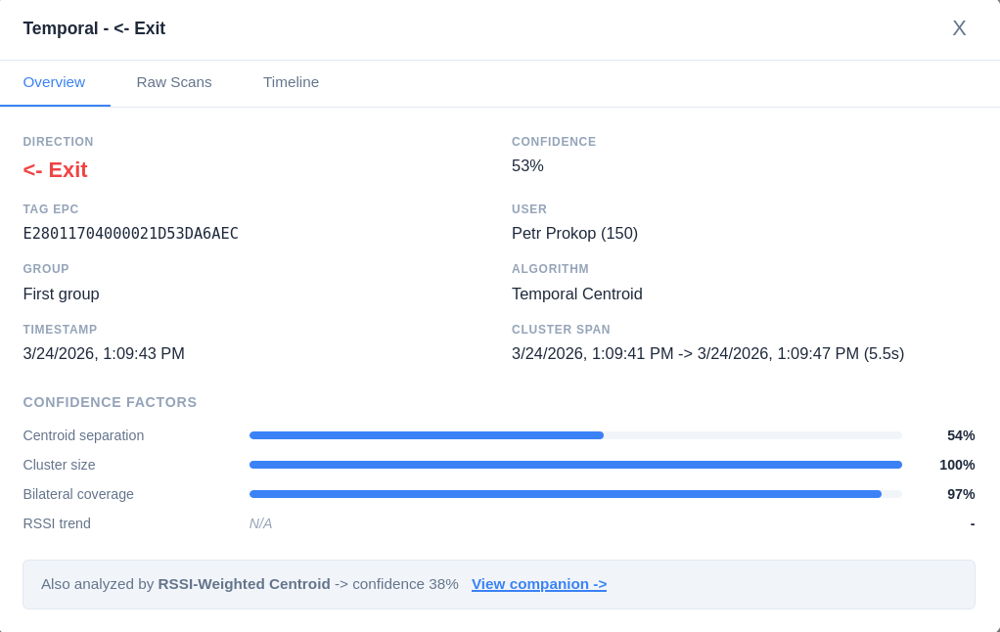
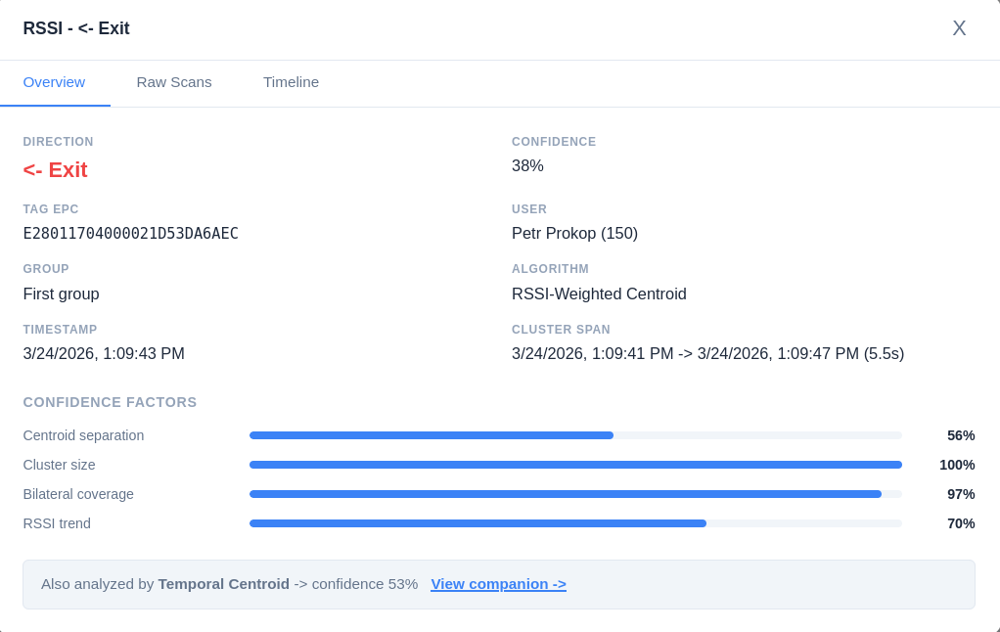

# OSNOVA PLUS - 3.5 dashboard

---

## 3.5.1 architecture and stack

- The dashboard is a single-page application built with SolidJS, chosen for its small bundle size and fine-grained reactivity model (no virtual DOM diffing)
- Routing uses `@solidjs/router` with five client-side routes; the SPA is served as a static build from the same BunJS process that hosts the API and MQTT broker
- Styling uses CSS modules scoped per component
- Real-time updates are delivered via a WebSocket connection established on application mount (`App.tsx`); the WebSocket store dispatches incoming messages to page-specific reactive stores, so each page updates independently without polling
- The API uses JWT authentication; dashboard users authenticate via `POST /api/v1/auth/login` and the token is attached to subsequent API requests

**Table 3.5.1-1** - WebSocket message types

| Message type     | Trigger                          | Consumer page(s) |
| ---------------- | -------------------------------- | ---------------- |
| `scan`           | New raw scan ingested            | Events           |
| `device:online`  | Lighthouse MQTT connect          | Lighthouses      |
| `device:offline` | Lighthouse MQTT disconnect / LWT | Lighthouses      |
| `device:health`  | Health telemetry received        | Lighthouses      |
| `device:pending` | Unknown device connects          | Lighthouses      |
| `event:new`      | Processed event created          | Processed Events |
| `event:orphaned` | Scans orphaned by sweeper        | Processed Events |

## 3.5.2 pages

### Lighthouses (`/`)

- Lists all registered Lighthouse devices with live status: online/offline indicator, last health telemetry (uptime, WiFi RSSI, RFID reader state, battery voltage/percentage/power source)
- Health data updates in real time via `device:health` WebSocket messages without page refresh
- Pending (unregistered) devices that connect to the MQTT broker appear in a separate section; the operator can claim a pending device by assigning it a name and placement (inside/outside)
- Device registration uses the ESP32's eFuse MAC address as the stable device identifier

### Groups (`/groups`)

- Groups pair two Lighthouses (one outside, one inside) into a detection portal
- Each group has configurable `activityTimeoutMs` (default 4 000 ms) controlling how long after the last scan the cluster is considered closed, and `orphanTimeoutMs` (default 8 000 ms) controlling when single-lighthouse scans are orphaned
- A lighthouse can belong to at most one group; ungrouped lighthouses have their scans orphaned by the event sweeper

### Events (`/events`)

- Real-time feed of raw scan events as they arrive from Lighthouse units; new scans are prepended to the table via the `scan` WebSocket message
- Filterable by lighthouse, EPC (partial match), scan source (`realtime` / `offline_sync`), and date range
- Serves as a debugging and monitoring tool - the operator can verify that tags are being detected and that both units in a portal are reporting scans

### Processed events (`/processed`)

- Displays the output of the direction detection pipeline: one row per processed event, showing direction (in/out/unknown), confidence, algorithm, tag EPC, user (if assigned), group, and timestamp
- Filterable by algorithm ID, direction, user, group, and date range
- Each row expands into a detail modal with three tabs:

**Overview tab:**

- Direction, confidence percentage, tag EPC, user, group, algorithm name, timestamp, and cluster time span
- Confidence factor breakdown displayed as horizontal progress bars: centroid separation, cluster size, bilateral coverage, and (for Algorithm 2) RSSI trend consistency
- Link to the companion event (same cluster, other algorithm) for side-by-side comparison

**Raw Scans tab:**

- Lists all raw scans belonging to the cluster, grouped by lighthouse (inside vs. outside), showing EPC, RSSI, timestamp, and time basis

**Timeline tab:**

- Scan timing histogram: horizontal time axis with bars representing scan detections per time bucket, colour-coded by lighthouse (blue = outside, orange = inside); centroid markers for the selected algorithm shown as dashed vertical lines
- For Algorithm 2: RSSI-over-time scatter plot below the histogram, with per-lighthouse regression lines illustrating the RSSI trend used in RTCF calculation

****

****

- All visualisations in the Timeline tab are rendered as inline SVG without external charting libraries

### Users (`/users`)

- Manages user records: name, email, and Navigo3 sync ID for integration
- Each user can have one active EPC tag assignment; previous assignments are preserved with a `revokedAt` timestamp for audit
